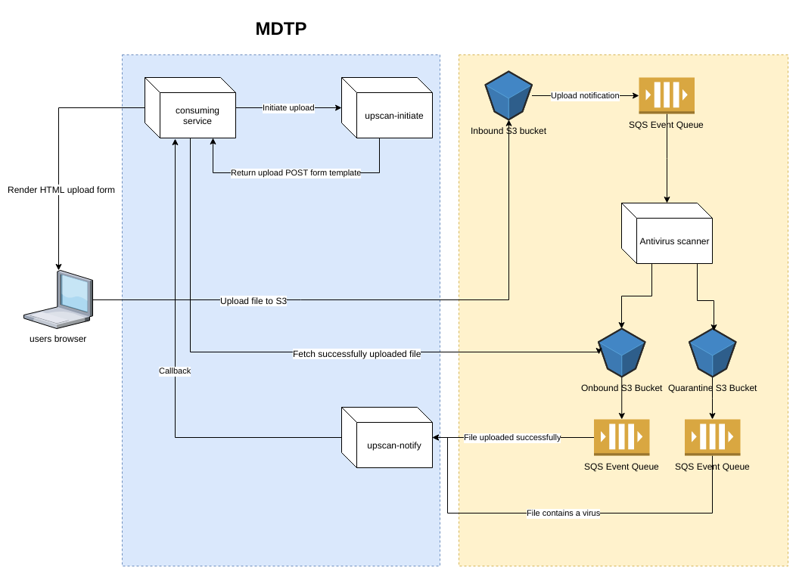

# upscan-initiate

Microservice for initiating the upload of files created externally to HMRC estate, namely from members of the public.
This is not intended to be used for transfer of files from one HMRC service to another, for this you need to intergrate
directly with the file transfer service.

[](https://travis-ci.org/hmrc/upscan-initiate) [  ](https://bintray.com/hmrc/releases/upscan-initiate/_latestVersion)

# Upscan user manual

## Introduction

Upscan service allows consuming services to orchestrate the process of uploading files by the end users. Upscan provides
temporary storage of uploaded file, ensures that the file isn't harmful (doesn't contain viruses) and fulfills
some predefined preconditions (like maximum size).
The process of uploading and verifying of uploaded file is performed asynchronously without involvement of consuming service.

## File upload workflow

* Consuming service requests upload of a single file. It makes a call to `/upscan/initiate` endpoint with details of
requested upload, including size constraints and callback URL 
* Upscan service replies with template of the HTTP POST form that should be used to upload the file and with unique reference
of the upload that can be later used by the consumer service to identify the file
* Consuming service returns the form to the user, the form is being displayed in users browser.
* User uploads the file using his web browser.
* In the background upscan service performs all necessary check of the file
* If file is safe, upscan service notifies consuming service, using previously provided callback URL. The callback body contains
an URL allowing to fetch uploaded file
* Consuming service downloads the file using provided URL. The link is valid for specified time (TODO - not specified yet)
* After specified time the file is automatically removed
* If the file is harmful (e.g. contains viruses), upscan notifies consuming service using previously provided callback URL. The callback
body contains detailed information about issues with the file.
* If consuming service fails to accept callback (service is down, answered with HTTP status other than 2xx), the callback will be retried
after specified time (TODO agree on that).

## Service usage

In order to initiate upload, consuming service have to make a POST request to `https://upscan.public.mdtp/upscan/initiate` endpoint
with details about expected upload, which include additional metadata, additional constraints
about content type and size, and callback URL which will be used to notify user. Here is an example of the request:
```
{
	"callbackUrl": "http://myservice.com/callback",
	"minimumFileSize" : 0,
	"maximumFileSize" : 1024,
	"expectedMimeType": "application/xml"
}
```
Meaning of parameters:

| Parameter name|Description|Required|
|--------------|-----------|--------|
|callbackUrl   |Url that will be called after file will be successfuly processed| yes|
|minimumFileSize|Minimum file size, if not specified any file size is allowed|no|
|maximumFileSize|Maximum file size, if not specified, global maximum file size will be applied (by default 100MB)|no|
|expectedMimeType|Expected MIME type of uploaded file|no|

The service replies with JSON containg reference of the upload and information about the POST form that has to be sent in order to upload the file:
```
{
    "reference": "11370e18-6e24-453e-b45a-76d3e32ea33d",
    "uploadRequest": {
        "href": "https://bucketName.s3.eu-west-2.amazonaws.com",
        "fields": {
            "X-Amz-Algorithm": "AWS4-HMAC-SHA256",
            "X-Amz-Expiration": "2018-02-09T12:35:45.297Z",
            "X-Amz-Signature": "xxxx",
            "key": "xxxxxx-xxxx-xxxx-xxxx-xxxxxxxxxxxx",
            "acl": "private",
            "X-Amz-Credential": "ASIAxxxxxxxxx/20180202/eu-west-2/s3/aws4_request",
            "policy": "xxxxxxxx=="
        }
    }
}
```
In order to upload the file, initiating microservice or the client should send the following form:
```
<form method="POST" href="...value of the href from the response above...">
    <input type="hidden" name="X-Amz-Algorithm" value="AWS4-HMAC-SHA256">
    ... all the fields returned in "fields" map in the response above ...
    <input type="file" name="file"/> <- form field representing the file to upload
    <input type="submit" value="OK"/>
</form>
```

You can also post this form programmatically from your backend code or make an async call using AJAX. 
It's important that the form will use multipart encoding (multipart/form-data), not application/x-www-form-urlencoded.
If you use application/x-www-form-urlencoded, AWS will be returning confusing error messages.
It's also important that the 'file' field of the form is the last one.

When form will be submitted succesfully, the service will return HTTP 204 response with empty body. In case of any error,
the service will return proper HTTP error response (4xx, 5xx) with details of the problem encoded as XML document. See Error handling
section for details.

When file is successfully uploaded by the user and checked by antivirus scanner, upscan service
will make a POST call to the URL specified as a 'callbackUrl' parameter with the following body:

```
{
    "reference" : "11370e18-6e24-453e-b45a-76d3e32ea33d",
    "fileStatus" : "READY",
    "url" : "https://bucketName.s3.eu-west-2.amazonaws.com?1235676"
}
```

If the virus has been detected in the file or there is any other problem with the file. The following callback is being
sent:

```
{
    "reference" : "11370e18-6e24-453e-b45a-76d3e32ea33d",
    "fileStatus" : "FAILED",
    "details" : "The file has a virus"
}
```
## Error handling

In case of problems with uploading the file (file too small, too large, configuration problems), AWS
will send response that complies with this document: https://docs.aws.amazon.com/AmazonS3/latest/API/ErrorResponses.html

## Design considerations

Service supports uploading single files only. If consuming service wants to upload multiple files during one user's journey,
it has to make multiple independent calls to upscan-initiate.

Callback URL provided by the service will be send in plain text through the network and visible to the end user. Because of that
URL shouldn't point to the host that is publicly available from outside of MDTP network. It shouldn't also contain any 
sensitive data (e.g. user identifiers, session tokens)
The callback will be done from the inside of MDTP environment, so that when specifying
callback URL.

Upscan intentionally doesn't allow to attach any metadata nor tags to the uploaded file. It's expected that the service
using upscan will keep track of requested uploads and keep the metadata internally.

It's not recommended to use Upscan to route/transfer files between different services on the platform.

# Architecture of the service



The service heavily relies on Amazon Web Services to provide desired functionality. The most important
AWS futures that are used by the service are:
* [Pre-signed POST requests](https://docs.aws.amazon.com/AmazonS3/latest/API/sigv4-UsingHTTPPOST.html) - to allow end users to upload file directly to S3
* [Pre-signed URLs](https://docs.aws.amazon.com/AmazonS3/latest/dev/ShareObjectPreSignedURL.html) - to allow consuming service to download uploaded file directly from S3

Upscan consists of the following components:
* **upscan-initiate service** - standalone service running on MDTP platform which creates pre-signed POST
forms that can be later used by consuming service to upload the file
* **inbound S3 bucket** - AWS S3 bucket used by users to upload their files
* **inbound event queue** - AWS SQS queue that contains events triggered by uploads to inbound S3 bucket
* **antivirus scanner** - component running on AWS that fetches files form inbound S3 bucket, scans them and if these are clean, moves to outbound bucket
* **outbound S3 bucket** - AWS S3 bucket containing files that have been verified by antivirus and are clean
* **outbound event queue** - AWS SQS queue that contains events triggered by copying clean files to outbound S3 bucket
* **quarantine S3 bucket** - whenever antivirus scanner detects virus in the file, it creates and object in this bucket that contains details of infected file
* **quarantine event queue** - AWS SQS queue that contains events triggered by detecting viruses in files
* **upscan-notify service** - standalone service running on MDTP platform which polls outbound and quarantine event queues for results
of file verification. This service makes calls to consuming services using callback url's provided at the beginning of the process

# Running and maintenance of the service

## Running locally

In order to run the service against one of HMRC accounts (labs, live) it's needed to have an AWS accounts with proper
role. See [UpScan Accounts/roles](https://github.tools.tax.service.gov.uk/HMRC/aws-users/blob/master/AccountLinks.md)
for proper details.

Prerequisites:
- AWS accounts with proper roles setup
- Proper AWS credential configuration set up according to this document [aws-credential-configuration](https://github.tools.tax.service.gov.uk/HMRC/aws-users), with the credentials below:
```
[upscan-service-prototypes-engineer]
source_profile = webops-users
aws_access_key_id = YOUR_ACCESS_KEY_HERE
aws_secret_access_key = YOUR_SECRET_KEY_HERE
output = json
region = eu-west-2
mfa_serial = arn:aws:iam::638924580364:mfa/your.username
role_arn = arn:aws:iam::415042754718:role/RoleServicePrototypesEngineer

[webops-users]
aws_access_key_id = YOUR_ACCESS_KEY_HERE
aws_secret_access_key = YOUR_SECRET_KEY_HERE
mfa_serial = arn:aws:iam::638924580364:mfa/your.username
region = eu-west-2
role_arn = arn:aws:iam::415042754718:role/RoleServicePrototypesEngineer
```
- Working AWS MFA authentication
- Have python 2.7 installed
- Install botocore and awscli python modules locally:
  - For Linux:
```
sudo pip install botocore
sudo pip install awscli
```
  - For Mac (Mac has issues with pre-installed version of ```six``` as discussed [here](https://github.com/pypa/pip/issues/3165):
```
sudo pip install botocore --ignore-installed six
sudo pip install awscli --ignore-installed six
```

In order to run the app against lab environment it's neeeded to run the following commands:
```
export AWS_DEFAULT_PROFILE=name_of_proper_profile_in_dot_aws_credentials_file
./aws-profile sbt
```
These commands will give you an access to SBT shell where you can run the service using 'run' or 'start' commands.
 

## Related projects, useful links:

* [upscan-notify](https://github.com/hmrc/upscan-notify) - service which is responsible for notifying consuming services about the status of file upload
* [upscan-infrastructue](https://github.com/hmrc/upscan-infrastructure) - AWS infrastructure provisioning scripts
* [upscan-acceptance-tests](https://github.com/hmrc/upscan-acceptance-tests) - acceptance tests of the service

### Tests

Upscan service has end-to-end acceptance tests which can be found in https://github.com/hmrc/upscan-acceptance-tests repository
### License

This code is open source software licensed under the [Apache 2.0 License]("http://www.apache.org/licenses/LICENSE-2.0.html")

### TO DO
* Resolve file constraints (mimetypes)
